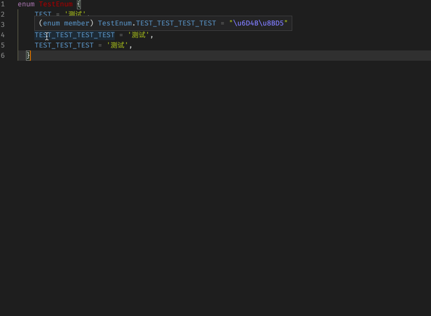

# string-util-for-vs-code README

一个使用lodash对文本进行处理的vscode小插件

## 功能

* 字符串 -> 驼峰/蛇形

* 使用内置函数对字符串进行处理

## 依赖

Lodash

## 插件设置

## 更新日志

### 0.1.0

使用内置函数对字符串进行处理

### 0.0.1

第一个版本

## TODO List

- 字符串数组转换成枚举值
